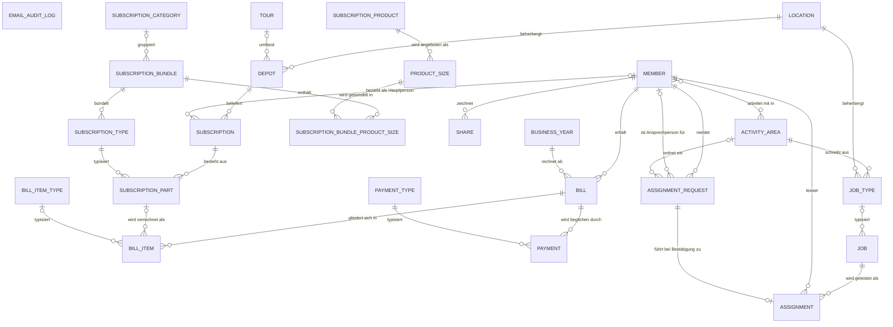

# Entity Model

Datenmodell im Umfeld der GartenBerg-Anpassungen an der juntagrico-Plattform. Enthalten sind
die von GartenBerg selbst definierte Entität `EMAIL_AUDIT_LOG` sowie jene Entitäten der
Plattform und der eingesetzten Erweiterungen (Rechnungen, Einsatzmeldungen), auf denen die
GartenBerg-spezifischen Anpassungen — Depotlisten je Produkt, Anmeldeprozess, Bezeichnung der
Abo-Bestandteile, Mailversand-Protokoll — unmittelbar aufbauen. Nicht abgebildet ist der
übrige Umfang der Plattform.

## Entity Relationship Diagram

### EMAIL_AUDIT_LOG

Beleg über eine von der Administration versendete Rundmail (GartenBerg-eigene Entität).

| Attribute        | Description                                              | Data Type | Length/Precision | Validation Rules |
|------------------|----------------------------------------------------------|-----------|------------------|------------------|
| id               | Eindeutiger Schlüssel                                    | Integer   | 10               | Primary Key, Sequence |
| timestamp        | Zeitpunkt des Versands, beim Anlegen gesetzt             | DateTime  | -                | Not Null |
| sender           | Absenderadresse des Versands                             | String    | 254              | Not Null |
| subject          | Betreff der versendeten Nachricht                        | String    | 500              | Not Null |
| recipient_groups | Angeschriebene Empfängergruppen, kommagetrennt           | String    | 500              | Not Null |
| url              | Verwendeter Versandweg                                   | String    | 200              | Not Null |

### MEMBER

Person, die Mitglied der Genossenschaft ist oder es werden möchte.

| Attribute        | Description                                                    | Data Type | Length/Precision | Validation Rules |
|------------------|----------------------------------------------------------------|-----------|------------------|------------------|
| id               | Eindeutiger Schlüssel                                          | Long      | 19               | Primary Key, Sequence |
| user_id          | Zugehöriges Login-Konto                                        | Long      | 19               | Not Null, Unique |
| first_name       | Vorname                                                        | String    | 30               | Not Null |
| last_name        | Nachname                                                       | String    | 30               | Not Null |
| email            | E-Mail-Adresse, zugleich Anmeldename                           | String    | 254              | Not Null, Unique, Format: Email |
| addr_street      | Strasse und Hausnummer                                         | String    | 100              | Not Null |
| addr_zipcode     | Postleitzahl                                                   | String    | 10               | Not Null |
| addr_location    | Ort                                                            | String    | 50               | Not Null |
| birthday         | Geburtsdatum                                                   | Date      | -                | Optional |
| phone            | Telefonnummer                                                  | String    | 50               | Not Null |
| mobile_phone     | Mobiltelefonnummer                                             | String    | 50               | Optional |
| iban             | Kontoverbindung für Rückzahlungen                              | String    | 100              | Optional |
| confirmed        | E-Mail-Adresse wurde bestätigt                                 | Boolean   | -                | Not Null, Values: true, false |
| reachable_by_email | Darf von der Einsatzseite aus kontaktiert werden             | Boolean   | -                | Not Null, Values: true, false |
| cancellation_date | Datum der Kündigung der Mitgliedschaft                        | Date      | -                | Optional |
| deactivation_date | Datum der Deaktivierung; sperrt die Anmeldung                 | Date      | -                | Optional |
| end_date         | Voraussichtliches Ende der Mitgliedschaft                      | Date      | -                | Optional |
| number           | Von der Administration vergebene Mitgliedernummer              | Integer   | 10               | Optional |
| signup_comment   | Kommentar, den die Person bei der Anmeldung hinterlassen hat   | String    | 4000             | Optional |
| notes            | Interne Notizen der Administration                             | String    | 4000             | Optional |

### SUBSCRIPTION

Abo, über das eine oder mehrere Personen gemeinsam Produkte beziehen.

| Attribute        | Description                                                  | Data Type | Length/Precision | Validation Rules |
|------------------|--------------------------------------------------------------|-----------|------------------|------------------|
| id               | Eindeutiger Schlüssel                                        | Long      | 19               | Primary Key, Sequence |
| depot_id         | Depot, in dem das Abo bezogen wird                           | Long      | 19               | Not Null, Foreign Key (DEPOT.id) |
| future_depot_id  | Künftiges Depot bei einem angemeldeten Depotwechsel          | Long      | 19               | Optional, Foreign Key (DEPOT.id) |
| primary_member_id | Hauptbezieherin oder Hauptbezieher des Abos                 | Long      | 19               | Optional, Foreign Key (MEMBER.id) |
| nickname         | Spitzname, der die Mitbeziehenden auf der Depotliste ersetzt | String    | 30               | Optional |
| start_date       | Gewünschtes Startdatum                                       | Date      | -                | Not Null |
| end_date         | Gewünschtes Enddatum                                         | Date      | -                | Optional |
| creation_date    | Datum der Erfassung                                          | Date      | -                | Optional |
| activation_date  | Datum, ab dem das Abo aktiv ist                              | Date      | -                | Optional |
| cancellation_date | Datum der Kündigung                                         | Date      | -                | Optional |
| deactivation_date | Datum, ab dem das Abo nicht mehr aktiv ist                  | Date      | -                | Optional |
| notes            | Interne Notizen der Administration                           | String    | 4000             | Optional |

### SUBSCRIPTION_PART

Einzelner Bestandteil eines Abos, der einem Abo-Typ entspricht.

| Attribute        | Description                                    | Data Type | Length/Precision | Validation Rules |
|------------------|------------------------------------------------|-----------|------------------|------------------|
| id               | Eindeutiger Schlüssel                          | Long      | 19               | Primary Key, Sequence |
| subscription_id  | Abo, zu dem der Bestandteil gehört             | Long      | 19               | Not Null, Foreign Key (SUBSCRIPTION.id) |
| type_id          | Abo-Typ des Bestandteils                       | Long      | 19               | Not Null, Foreign Key (SUBSCRIPTION_TYPE.id) |
| creation_date    | Datum der Erfassung                            | Date      | -                | Optional |
| activation_date  | Datum, ab dem der Bestandteil aktiv ist        | Date      | -                | Optional |
| cancellation_date | Datum der Kündigung des Bestandteils          | Date      | -                | Optional |
| deactivation_date | Datum, ab dem der Bestandteil nicht mehr aktiv ist | Date  | -                | Optional |

### SUBSCRIPTION_TYPE

Bestellbare Variante eines Abo-Pakets mit Preis, Einsatzpflicht und Anteilscheinbedarf.

| Attribute                | Description                                                  | Data Type | Length/Precision | Validation Rules |
|--------------------------|--------------------------------------------------------------|-----------|------------------|------------------|
| id                       | Eindeutiger Schlüssel                                        | Long      | 19               | Primary Key, Sequence |
| name                     | Kurzname, erscheint in der Bezeichnung des Bestandteils      | String    | 100              | Not Null |
| long_name                | Ausgeschriebener Name                                        | String    | 100              | Optional |
| bundle_id                | Abo-Paket, zu dem die Variante gehört                        | Long      | 19               | Not Null, Foreign Key (SUBSCRIPTION_BUNDLE.id) |
| shares                   | Anzahl der dafür benötigten Anteilscheine                    | Integer   | 10               | Not Null, Min: 0 |
| required_assignments     | Anzahl der zu leistenden Einsätze                            | Decimal   | 10,2             | Not Null, Min: 0 |
| required_core_assignments | Anzahl der zu leistenden Einsätze im Kernbereich            | Decimal   | 10,2             | Not Null, Min: 0 |
| price                    | Preis der Variante                                           | Decimal   | 9,2              | Not Null, Min: 0 |
| visible                  | Wird im Anmeldeprozess angeboten                             | Boolean   | -                | Not Null, Values: true, false |
| is_extra                 | Ist ein Zusatz-Abo                                           | Boolean   | -                | Not Null, Values: true, false |
| trial_days               | Dauer einer Probe-Mitgliedschaft in Tagen; 0 bedeutet keine  | Integer   | 10               | Not Null, Min: 0 |
| description              | Beschreibung der Variante                                    | String    | 4000             | Optional |
| interval                 | Lieferintervall in Wochen                                    | Integer   | 10               | Not Null, Min: 1 |
| offset                   | Versatz der ersten Lieferung in Wochen                       | Integer   | 10               | Not Null, Min: 0 |
| sort_order               | Position in Auswahllisten                                    | Integer   | 10               | Not Null, Min: 0 |

### SUBSCRIPTION_BUNDLE

Abo-Paket, das eine oder mehrere Produktgrössen zu einer bestellbaren Einheit zusammenfasst.

| Attribute    | Description                                                       | Data Type | Length/Precision | Validation Rules |
|--------------|-------------------------------------------------------------------|-----------|------------------|------------------|
| id           | Eindeutiger Schlüssel                                             | Long      | 19               | Primary Key, Sequence |
| long_name    | Name des Pakets, erscheint in der Bezeichnung des Bestandteils    | String    | 100              | Not Null |
| description  | Beschreibung des Pakets                                           | String    | 4000             | Optional |
| category_id  | Kategorie; ohne Kategorie ist das Paket nicht bestellbar          | Long      | 19               | Optional, Foreign Key (SUBSCRIPTION_CATEGORY.id) |
| sort_order   | Position in Auswahllisten                                         | Integer   | 10               | Not Null, Min: 0 |

### SUBSCRIPTION_BUNDLE_PRODUCT_SIZE

Zuordnung einer Produktgrösse zu einem Abo-Paket; dieselbe Grösse kann mehrfach enthalten sein.

| Attribute       | Description                          | Data Type | Length/Precision | Validation Rules |
|-----------------|--------------------------------------|-----------|------------------|------------------|
| id              | Eindeutiger Schlüssel                | Long      | 19               | Primary Key, Sequence |
| bundle_id       | Zugeordnetes Abo-Paket               | Long      | 19               | Not Null, Foreign Key (SUBSCRIPTION_BUNDLE.id) |
| product_size_id | Zugeordnete Produktgrösse            | Long      | 19               | Not Null, Foreign Key (PRODUCT_SIZE.id) |

### SUBSCRIPTION_CATEGORY

Gruppierung der Abo-Pakete im Bestellprozess.

| Attribute   | Description                        | Data Type | Length/Precision | Validation Rules |
|-------------|------------------------------------|-----------|------------------|------------------|
| id          | Eindeutiger Schlüssel              | Long      | 19               | Primary Key, Sequence |
| name        | Name der Kategorie                 | String    | 100              | Not Null, Unique |
| description | Beschreibung der Kategorie         | String    | 4000             | Optional |
| sort_order  | Position in Auswahllisten          | Integer   | 10               | Not Null, Min: 0 |

### SUBSCRIPTION_PRODUCT

Produkt, das die Genossenschaft abgibt; bei GartenBerg Gemüse, Kartoffeln, Mehl und Glarner Alpkäse.

| Attribute   | Description                                                        | Data Type | Length/Precision | Validation Rules |
|-------------|--------------------------------------------------------------------|-----------|------------------|------------------|
| id          | Eindeutiger Schlüssel                                              | Long      | 19               | Primary Key, Sequence |
| name        | Produktname; steuert die Auswahl der produktbezogenen Depotlisten  | String    | 100              | Not Null, Unique |
| description | Beschreibung, erscheint im Kopf der Depotliste                     | String    | 4000             | Optional |
| sort_order  | Position auf Listen und in Auswahllisten                           | Integer   | 10               | Not Null, Min: 0 |

### PRODUCT_SIZE

Grösse, in der ein Produkt bezogen werden kann; bildet eine Spalte der Depotliste.

| Attribute          | Description                                                  | Data Type | Length/Precision | Validation Rules |
|--------------------|--------------------------------------------------------------|-----------|------------------|------------------|
| id                 | Eindeutiger Schlüssel                                        | Long      | 19               | Primary Key, Sequence |
| name               | Bezeichnung der Grösse                                       | String    | 100              | Not Null |
| units              | Anzahl Einheiten, die die Grösse umfasst                     | Decimal   | 10,2             | Not Null, Min: 0 |
| show_on_depot_list | Erscheint als Spalte auf der Depotliste                      | Boolean   | -                | Not Null, Values: true, false |
| product_id         | Produkt, zu dem die Grösse gehört                            | Long      | 19               | Not Null, Foreign Key (SUBSCRIPTION_PRODUCT.id) |
| sort_order         | Spaltenreihenfolge auf der Depotliste                        | Integer   | 10               | Not Null, Min: 0 |

### DEPOT

Abgabestelle, an der die Mitglieder ihre Produkte abholen.

| Attribute          | Description                                                   | Data Type | Length/Precision | Validation Rules |
|--------------------|---------------------------------------------------------------|-----------|------------------|------------------|
| id                 | Eindeutiger Schlüssel                                         | Long      | 19               | Primary Key, Sequence |
| name               | Name des Depots                                               | String    | 100              | Not Null, Unique |
| tour_id            | Ausfahrt, zu der das Depot gehört                             | Long      | 19               | Optional, Foreign Key (TOUR.id) |
| weekday            | Abholtag                                                      | Integer   | 10               | Not Null, Min: 1, Max: 7 |
| pickup_time        | Beginn des Abholzeitfensters                                  | DateTime  | -                | Optional |
| pickup_duration    | Dauer des Abholzeitfensters in Stunden                        | Decimal   | 10,2             | Optional, Min: 0 |
| capacity           | Anzahl der Plätze im Depot                                    | Integer   | 10               | Not Null, Min: 0 |
| location_id        | Ort, an dem sich das Depot befindet                           | Long      | 19               | Not Null, Foreign Key (LOCATION.id) |
| fee                | Zusatzkosten, die für dieses Depot anfallen                   | Decimal   | 9,2              | Not Null, Min: 0 |
| description        | Öffentlich sichtbare Beschreibung, auch im Anmeldeprozess     | String    | 4000             | Optional |
| access_information | Zugangsbeschreibung, nur für Beziehende des Depots sichtbar   | String    | 4000             | Optional |
| depot_list         | Erscheint auf der Depotliste                                  | Boolean   | -                | Not Null, Values: true, false |
| visible            | Wird im Anmeldeprozess angeboten                              | Boolean   | -                | Not Null, Values: true, false |
| sort_order         | Reihenfolge auf Listen                                        | Integer   | 10               | Not Null, Min: 0 |

### LOCATION

Ort mit Adresse und Koordinaten, an dem ein Depot oder ein Einsatz stattfindet.

| Attribute     | Description                                    | Data Type | Length/Precision | Validation Rules |
|---------------|------------------------------------------------|-----------|------------------|------------------|
| id            | Eindeutiger Schlüssel                          | Long      | 19               | Primary Key, Sequence |
| name          | Name des Orts                                  | String    | 100              | Not Null, Unique |
| latitude      | Breitengrad                                    | Decimal   | 9,6              | Optional |
| longitude     | Längengrad                                     | Decimal   | 9,6              | Optional |
| addr_street   | Strasse und Hausnummer                         | String    | 100              | Optional |
| addr_zipcode  | Postleitzahl                                   | String    | 10               | Optional |
| addr_location | Ort                                            | String    | 50               | Optional |
| description   | Beschreibung des Orts                          | String    | 4000             | Optional |
| visible       | Steht bei Einsatz und Depot zur Auswahl        | Boolean   | -                | Not Null, Values: true, false |
| sort_order    | Position in Auswahllisten                      | Integer   | 10               | Not Null, Min: 0 |

### SHARE

Anteilschein, den ein Mitglied gezeichnet hat.

| Attribute               | Description                                                | Data Type | Length/Precision | Validation Rules |
|-------------------------|------------------------------------------------------------|-----------|------------------|------------------|
| id                      | Eindeutiger Schlüssel                                      | Long      | 19               | Primary Key, Sequence |
| member_id               | Mitglied, dem der Anteilschein gehört                      | Long      | 19               | Not Null, Foreign Key (MEMBER.id) |
| value                   | Wert des Anteilscheins; bei GartenBerg 750                 | Decimal   | 8,2              | Not Null, Min: 0 |
| number                  | Vergebene Anteilscheinnummer                               | Integer   | 10               | Optional |
| creation_date           | Datum der Zeichnung                                        | Date      | -                | Optional |
| paid_date               | Datum des Zahlungseingangs                                 | Date      | -                | Optional |
| issue_date              | Datum der Ausstellung                                      | Date      | -                | Optional |
| booking_date            | Datum der Verbuchung                                       | Date      | -                | Optional |
| cancelled_date          | Datum der Kündigung                                        | Date      | -                | Optional |
| termination_date        | Datum, auf das gekündigt wurde                             | Date      | -                | Optional |
| payback_date            | Datum der Rückzahlung                                      | Date      | -                | Optional |
| sent_back               | Anteilschein wurde zurückgesandt                           | Boolean   | -                | Not Null, Values: true, false |
| reason_for_acquisition  | Grund des Erwerbs                                          | Integer   | 10               | Optional, Values: 1, 2, 3, 4, 5, 6 |
| reason_for_cancellation | Grund der Kündigung                                        | Integer   | 10               | Optional, Values: 1, 2, 3, 4 |
| notes                   | Interne Notizen der Administration                         | String    | 4000             | Optional |

### ACTIVITY_AREA

Tätigkeitsbereich, in dem Einsätze geleistet und gemeldete Einsätze beurteilt werden.

| Attribute             | Description                                                   | Data Type | Length/Precision | Validation Rules |
|-----------------------|---------------------------------------------------------------|-----------|------------------|------------------|
| id                    | Eindeutiger Schlüssel                                         | Long      | 19               | Primary Key, Sequence |
| name                  | Name des Tätigkeitsbereichs                                   | String    | 100              | Not Null, Unique |
| description           | Beschreibung des Tätigkeitsbereichs                           | String    | 4000             | Not Null |
| core                  | Ist ein Kernbereich                                           | Boolean   | -                | Not Null, Values: true, false |
| hidden                | Wird auf der Bereichsübersicht nicht angezeigt                | Boolean   | -                | Not Null, Values: true, false |
| auto_add_new_members  | Neue Mitglieder werden dem Bereich automatisch zugeordnet     | Boolean   | -                | Not Null, Values: true, false |
| sort_order            | Position auf der Bereichsübersicht                            | Integer   | 10               | Not Null, Min: 0 |

### JOB_TYPE

Einsatzart, die den wiederkehrend ausgeschriebenen Einsätzen ihre Vorgaben gibt.

| Attribute        | Description                                          | Data Type | Length/Precision | Validation Rules |
|------------------|------------------------------------------------------|-----------|------------------|------------------|
| id               | Eindeutiger Schlüssel                                | Long      | 19               | Primary Key, Sequence |
| name             | Interner Name der Einsatzart                         | String    | 100              | Not Null, Unique |
| displayed_name   | Auf der Einsatzübersicht angezeigter Name            | String    | 100              | Optional |
| description      | Beschreibung der Einsatzart                          | String    | 4000             | Not Null |
| activityarea_id  | Tätigkeitsbereich, dem die Einsatzart zugeordnet ist | Long      | 19               | Not Null, Foreign Key (ACTIVITY_AREA.id) |
| location_id      | Ort, an dem der Einsatz stattfindet                  | Long      | 19               | Not Null, Foreign Key (LOCATION.id) |
| default_duration | Vorgabewert für die Dauer in Stunden                 | Decimal   | 10,2             | Not Null, Min: 0 |
| visible          | Wird auf der Einsatzübersicht angezeigt              | Boolean   | -                | Not Null, Values: true, false |

### JOB

Ausgeschriebener Arbeitseinsatz zu einem bestimmten Zeitpunkt, für den sich Mitglieder anmelden.

| Attribute      | Description                                                                     | Data Type | Length/Precision | Validation Rules |
|----------------|---------------------------------------------------------------------------------|-----------|------------------|------------------|
| id             | Eindeutiger Schlüssel                                                           | Long      | 19               | Primary Key, Sequence |
| type_id        | Einsatzart bei wiederkehrenden Einsätzen; einmalige Einsätze führen ihre Angaben selbst | Long | 19          | Optional, Foreign Key (JOB_TYPE.id) |
| time           | Zeitpunkt des Einsatzes                                                         | DateTime  | -                | Not Null |
| slots          | Anzahl der Plätze                                                               | Integer   | 10               | Not Null, Min: 0 |
| infinite_slots | Der Einsatz hat unbeschränkt viele Plätze                                       | Boolean   | -                | Not Null, Values: true, false |
| multiplier     | Faktor, mit dem eine Teilnahme angerechnet wird                                 | Decimal   | 10,2             | Not Null, Min: 0 |
| pinned         | Wird auf der Einsatzübersicht hervorgehoben                                     | Boolean   | -                | Not Null, Values: true, false |
| canceled       | Der Einsatz wurde abgesagt                                                      | Boolean   | -                | Not Null, Values: true, false |
| reminder_sent  | Die Erinnerung an die Angemeldeten wurde versandt                               | Boolean   | -                | Not Null, Values: true, false |

### ASSIGNMENT

Anrechnung eines geleisteten Einsatzes an ein Mitglied.

| Attribute  | Description                                              | Data Type | Length/Precision | Validation Rules |
|------------|----------------------------------------------------------|-----------|------------------|------------------|
| id         | Eindeutiger Schlüssel                                    | Long      | 19               | Primary Key, Sequence |
| job_id     | Einsatz, für den die Anrechnung erfolgt                   | Long      | 19               | Not Null, Foreign Key (JOB.id) |
| member_id  | Mitglied, dem der Einsatz angerechnet wird                | Long      | 19               | Not Null, Foreign Key (MEMBER.id) |
| amount     | Angerechneter Wert des Einsatzes                          | Decimal   | 10,2             | Not Null, Min: 0 |
| core_cache | Der Einsatz zählt als Einsatz im Kernbereich              | Boolean   | -                | Not Null, Values: true, false |

### ASSIGNMENT_REQUEST

Meldung eines Mitglieds über selbständig geleistete Arbeit, die von einer Ansprechperson beurteilt wird.

| Attribute       | Description                                                                        | Data Type | Length/Precision | Validation Rules |
|-----------------|------------------------------------------------------------------------------------|-----------|------------------|------------------|
| id              | Eindeutiger Schlüssel                                                              | Long      | 19               | Primary Key, Sequence |
| member_id       | Mitglied, das den Einsatz gemeldet hat                                             | Long      | 19               | Not Null, Foreign Key (MEMBER.id) |
| approver_id     | Ansprechperson, an die die Anfrage gerichtet ist                                   | Long      | 19               | Optional, Foreign Key (MEMBER.id) |
| activityarea_id | Tätigkeitsbereich, dem die Arbeit zugeordnet wird                                  | Long      | 19               | Optional, Foreign Key (ACTIVITY_AREA.id) |
| assignment_id   | Anrechnung, die bei der Bestätigung entsteht                                       | Long      | 19               | Optional, Unique, Foreign Key (ASSIGNMENT.id) |
| job_time        | Zeitpunkt, zu dem die Arbeit geleistet wurde                                       | DateTime  | -                | Not Null |
| amount          | Anzahl der beantragten Einsätze                                                    | Decimal   | 10,2             | Not Null, Min: 0 |
| duration        | Dauer der Arbeit in Stunden                                                        | Decimal   | 4,2              | Not Null, Min: 0 |
| location        | Ort, an dem die Arbeit geleistet wurde                                             | String    | 100              | Optional |
| description     | Beschreibung der geleisteten Arbeit                                                | String    | 1000             | Optional |
| request_date    | Datum der Meldung                                                                  | Date      | -                | Optional |
| response_date   | Datum der Beurteilung                                                              | Date      | -                | Optional |
| status          | Stand der Beurteilung: RE beantragt, CO bestätigt, NO abgelehnt                    | String    | 2                | Not Null, Values: RE, CO, NO |
| response        | Rückmeldung der Ansprechperson an das Mitglied                                     | String    | 4000             | Optional |

### BUSINESS_YEAR

Geschäftsjahr, das eine Rechnungsperiode abgrenzt.

| Attribute  | Description                    | Data Type | Length/Precision | Validation Rules |
|------------|--------------------------------|-----------|------------------|------------------|
| id         | Eindeutiger Schlüssel          | Long      | 19               | Primary Key, Sequence |
| start_date | Beginn des Geschäftsjahres     | Date      | -                | Not Null, Unique |
| end_date   | Ende des Geschäftsjahres       | Date      | -                | Not Null |
| name       | Bezeichnung des Geschäftsjahres | String   | 20               | Optional, Unique |

### BILL

Rechnung an ein Mitglied für ein Geschäftsjahr.

| Attribute         | Description                                              | Data Type | Length/Precision | Validation Rules |
|-------------------|----------------------------------------------------------|-----------|------------------|------------------|
| id                | Eindeutiger Schlüssel                                    | Long      | 19               | Primary Key, Sequence |
| business_year_id  | Geschäftsjahr, das abgerechnet wird                      | Long      | 19               | Not Null, Foreign Key (BUSINESS_YEAR.id) |
| member_id         | Mitglied, an das die Rechnung geht                       | Long      | 19               | Not Null, Foreign Key (MEMBER.id) |
| bill_date         | Rechnungsdatum                                           | Date      | -                | Not Null |
| booking_date      | Verbuchungsdatum                                         | Date      | -                | Not Null |
| amount            | Rechnungsbetrag                                          | Decimal   | 10,2             | Not Null, Min: 0 |
| vat_rate          | Angewendeter Mehrwertsteuersatz                          | Decimal   | 6,4              | Not Null, Min: 0 |
| paid              | Rechnung ist ausgeglichen                                | Boolean   | -                | Not Null, Values: true, false |
| published         | Rechnung ist für das Mitglied freigegeben                | Boolean   | -                | Not Null, Values: true, false |
| notification_sent | Mitglied wurde über die Rechnung benachrichtigt          | Boolean   | -                | Not Null, Values: true, false |
| public_notes      | Für das Mitglied sichtbare Bemerkungen                   | String    | 4000             | Optional |
| private_notes     | Interne Bemerkungen der Administration                   | String    | 4000             | Optional |

### BILL_ITEM

Position einer Rechnung, entweder für einen Abo-Bestandteil oder für einen eigenen Positionstyp.

| Attribute            | Description                                              | Data Type | Length/Precision | Validation Rules |
|----------------------|----------------------------------------------------------|-----------|------------------|------------------|
| id                   | Eindeutiger Schlüssel                                    | Long      | 19               | Primary Key, Sequence |
| bill_id              | Rechnung, zu der die Position gehört                     | Long      | 19               | Not Null, Foreign Key (BILL.id) |
| subscription_part_id | Verrechneter Abo-Bestandteil                             | Long      | 19               | Optional, Foreign Key (SUBSCRIPTION_PART.id) |
| custom_item_type_id  | Positionstyp bei Positionen ohne Abo-Bezug               | Long      | 19               | Optional, Foreign Key (BILL_ITEM_TYPE.id) |
| description          | Beschreibung der Position                                | String    | 100              | Optional |
| amount               | Betrag der Position                                      | Decimal   | 10,2             | Not Null, Min: 0 |
| vat_amount           | Im Betrag enthaltener Steueranteil                       | Decimal   | 10,2             | Not Null, Min: 0 |

### BILL_ITEM_TYPE

Typ für Rechnungspositionen, die sich nicht aus einem Abo-Bestandteil ergeben.

| Attribute       | Description                              | Data Type | Length/Precision | Validation Rules |
|-----------------|------------------------------------------|-----------|------------------|------------------|
| id              | Eindeutiger Schlüssel                    | Long      | 19               | Primary Key, Sequence |
| name            | Bezeichnung des Positionstyps            | String    | 50               | Not Null |
| booking_account | Konto, auf das die Position gebucht wird | String    | 10               | Not Null |

### PAYMENT

Zahlungseingang, der auf einer Rechnung verbucht wird.

| Attribute     | Description                                        | Data Type | Length/Precision | Validation Rules |
|---------------|----------------------------------------------------|-----------|------------------|------------------|
| id            | Eindeutiger Schlüssel                              | Long      | 19               | Primary Key, Sequence |
| bill_id       | Rechnung, auf die die Zahlung verbucht wird        | Long      | 19               | Not Null, Foreign Key (BILL.id) |
| type_id       | Zahlungsart                                        | Long      | 19               | Not Null, Foreign Key (PAYMENT_TYPE.id) |
| paid_date     | Datum des Zahlungseingangs                         | Date      | -                | Not Null |
| amount        | Einbezahlter Betrag                                | Decimal   | 10,2             | Not Null, Min: 0 |
| unique_id     | Kennzeichen des Zahlungseingangs der Bank          | String    | 50               | Optional, Unique |
| private_notes | Interne Bemerkungen der Administration             | String    | 4000             | Optional |

### PAYMENT_TYPE

Zahlungsart mit Kontoverbindung und Buchungskonto.

| Attribute       | Description                              | Data Type | Length/Precision | Validation Rules |
|-----------------|------------------------------------------|-----------|------------------|------------------|
| id              | Eindeutiger Schlüssel                    | Long      | 19               | Primary Key, Sequence |
| name            | Bezeichnung der Zahlungsart              | String    | 50               | Optional |
| iban            | Kontoverbindung der Genossenschaft       | String    | 30               | Optional |
| booking_account | Konto, auf das die Zahlung gebucht wird  | String    | 10               | Not Null |

### TOUR

Ausfahrt, zu der mehrere Depots zusammengefasst werden.

| Attribute        | Description                          | Data Type | Length/Precision | Validation Rules |
|------------------|--------------------------------------|-----------|------------------|------------------|
| id               | Eindeutiger Schlüssel                | Long      | 19               | Primary Key, Sequence |
| name             | Name der Ausfahrt                    | String    | 100              | Not Null, Unique |
| description      | Beschreibung der Ausfahrt            | String    | 4000             | Optional |
| weekday          | Wochentag der Ausfahrt               | Integer   | 10               | Optional, Min: 1, Max: 7 |
| visible_on_list  | Erscheint auf Listen                 | Boolean   | -                | Not Null, Values: true, false |
| sort_order       | Reihenfolge auf Listen               | Integer   | 10               | Not Null, Min: 0 |
